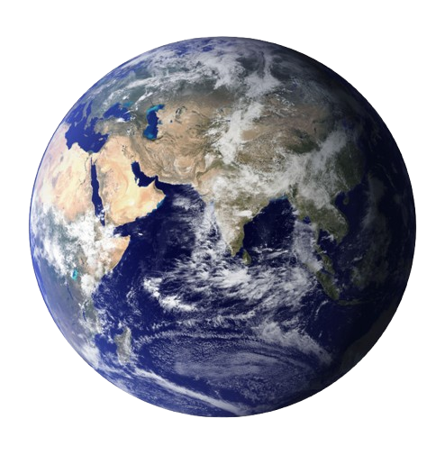

# salvailmondo
Presentazione sul riscaldamento globale.

Sito Web hostato qui su GitHub dal main branch, scritte in JavaScript, CSS è HTML tutte da me, unite in un solo HTML.
288 linee, tempo di lavoro: 7 giorni.
Autovalutazione: 7, ho messo molto impegno su questo sito programmandolo da 0, e spero che verrò ripagato.

